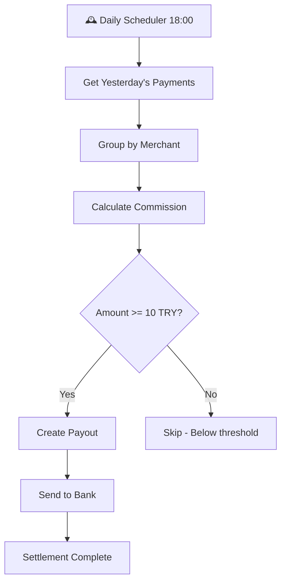

# 💰 DAILY SETTLEMENT SYSTEM

Payment Gateway'de günlük otomatik settlement sistemi - Merchant'ların completed transaction'larını her gün otomatik olarak payout yapar.

## 🚀 Özellikler

### ⏰ Otomatik Settlement
- **Zaman**: Her gün saat 18:00'da otomatik çalışır
- **Gecikme**: 1 gün (T-1 settlement)
- **Kapsam**: Tüm completed payment'lar

### 💸 Komisyon Hesaplama
- **Oran**: %2.5 + 0.50 TL sabit ücret
- **Hesaplama**: `Commission = (Amount × 2.5%) + 0.50 TL`
- **Net Tutar**: `Net = Gross - Commission`

### 🏦 Payout Detayları
- **Minimum Tutar**: 10.00 TRY
- **Banka Entegrasyonu**: Garanti BBVA, İş Bankası, Akbank
- **Payout Türü**: BANK_TRANSFER

## 📋 API Endpoints

### 1. Manuel Settlement Tetikleme
```bash
POST /v1/settlement/trigger?date=2024-01-15
```

### 2. Settlement Özeti
```bash
GET /v1/settlement/summary/MERCHANT123?startDate=2024-01-01&endDate=2024-01-31
```

### 3. Settlement Durumu
```bash
GET /v1/settlement/status
```

### 4. Test Settlement
```bash
POST /v1/settlement/test-daily
```

## 🔧 Konfigürasyon

### Scheduler Ayarları
```java
@Scheduled(cron = "0 0 18 * * ?") // Her gün 18:00
```

### Komisyon Ayarları
```java
BigDecimal commissionRate = new BigDecimal("0.025"); // %2.5
BigDecimal fixedFee = new BigDecimal("0.50"); // 0.50 TL
```

### Minimum Payout
```java
BigDecimal minimumPayoutAmount = new BigDecimal("10.00"); // 10 TL
```

## 🗄️ Database Schema

### Merchant Tablosu Yeni Alanlar
```sql
ALTER TABLE merchants ADD COLUMN business_name VARCHAR(255);
ALTER TABLE merchants ADD COLUMN contact_name VARCHAR(255);
ALTER TABLE merchants ADD COLUMN bank_name VARCHAR(100);
ALTER TABLE merchants ADD COLUMN bank_account_number VARCHAR(50);
ALTER TABLE merchants ADD COLUMN bank_routing_number VARCHAR(50);
ALTER TABLE merchants ADD COLUMN iban VARCHAR(50);
```

### Settlement View
```sql
CREATE VIEW settlement_summary AS
SELECT 
    merchant_id,
    settlement_date,
    transaction_count,
    gross_amount,
    commission,
    net_amount
FROM ...
```

## 🔄 Settlement Akışı



## 📊 Settlement Süreci

### 1. **Veri Toplama**
```java
// Dünkü completed payment'ları getir
LocalDate yesterday = LocalDate.now().minusDays(1);
List<Payment> payments = getCompletedPaymentsForDate(yesterday);
```

### 2. **Merchant Gruplama**
```java
// Merchant'lara göre grupla
Map<String, List<Payment>> paymentsByMerchant = payments.stream()
    .collect(Collectors.groupingBy(Payment::getMerchantId));
```

### 3. **Komisyon Hesaplama**
```java
// Her merchant için komisyon hesapla
BigDecimal totalAmount = payments.stream()
    .map(Payment::getAmount)
    .reduce(BigDecimal.ZERO, BigDecimal::add);

BigDecimal commission = totalAmount.multiply(commissionRate).add(fixedFee);
BigDecimal netAmount = totalAmount.subtract(commission);
```

### 4. **Payout Oluşturma**
```java
// Settlement payout request oluştur
PayoutRequest request = new PayoutRequest();
request.setMerchantId(merchantId);
request.setAmount(netAmount);
request.setType(Payout.PayoutType.BANK_TRANSFER);
request.setDescription("Daily settlement for " + settlementDate);
```

## 🧪 Test Etme

### 1. Test Payment'ları Oluştur
```bash
# Completed payment oluştur
POST /v1/payments/
{
  "merchantId": "TEST_MERCHANT_001",
  "amount": 100.00,
  "status": "COMPLETED"
}
```

### 2. Manuel Settlement Tetikle
```bash
# Belirli tarih için settlement yap
POST /v1/settlement/trigger?date=2024-01-15
```

### 3. Settlement Sonuçlarını Kontrol Et
```bash
# Settlement özetini getir
GET /v1/settlement/summary/TEST_MERCHANT_001?startDate=2024-01-15&endDate=2024-01-15
```

## 📈 Monitoring ve Logging

### Audit Logs
- `DAILY_SETTLEMENT`: Günlük settlement süreci
- `MERCHANT_SETTLEMENT`: Merchant bazında settlement
- `SETTLEMENT_ERROR`: Settlement hataları

### Log Örnekleri
```
INFO  - 🕰️ Starting daily settlement process at 2024-01-16T18:00:00
INFO  - Processing settlement for 15 merchants
INFO  - ✅ Settlement payout created successfully for MERCHANT123: POUT-ABC12345
ERROR - ❌ Settlement payout failed for MERCHANT456: Insufficient bank details
```

## ⚠️ Önemli Notlar

1. **Settlement Gecikmesi**: Settlement T-1 bazında çalışır (1 gün gecikmeli)
2. **Minimum Tutar**: 10 TL altındaki tutarlar settle edilmez
3. **Banka Bilgileri**: Merchant'ın banka bilgileri eksikse settlement başarısız olur
4. **Commission**: Her transaction için sabit ücret + yüzde komisyon alınır
5. **Retry Logic**: Başarısız settlement'lar manuel olarak tekrar denenebilir

## 🔐 Güvenlik

- Settlement süreçleri audit log'a kaydedilir
- Banka bilgileri şifrelenir
- API endpoint'leri authentication gerektirir
- Commission hesaplamaları doğrulanır

## 📞 Destek

Settlement ile ilgili sorunlar için:
- Log dosyalarını kontrol edin
- `/v1/settlement/status` endpoint'ini kullanın
- Manuel settlement ile test edin
- Audit log'ları inceleyin

---

**Settlement Sistemi Aktif! 🚀**
Her gün saat 18:00'da otomatik çalışmaktadır.
